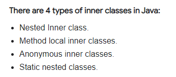
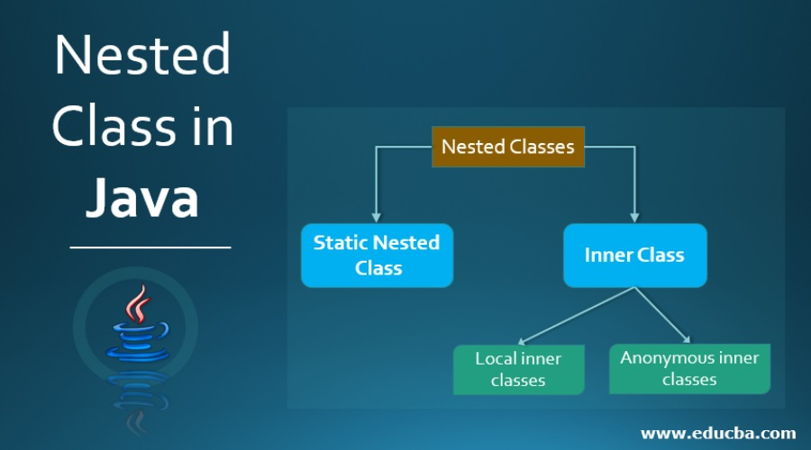
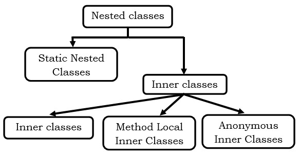

= Good to know:

There are static nested classes and nonstatic nested classes (we also call it inner class)!

The static nested class is mainly used associate a class with its outer class. It is packaged in its outer class, rather than in the package. It cannot access the nonstatic methods or members of its outer class without first creating an instance of that class!

Inner class:

Local classes are declared inside the block, such as method or an if statement, and their scope is restricted completely to that particular block.

Anonymous classes: is also a local class, but has no name! They have to be declared and instantiated at the same time, because they haven't got a name. They are used when a local class is required only once! In fact, they are very common for attaching event handlers to buttons in a user interface. (e.g. Android apps.) Like button click every button has a special functionality!

